# NEST equations and end-to-end artifact pipeline

## Purpose and handoff status

This document is the implementation map for the NEST/NESTML engine line. It explains:

1. which equations are encoded in each committed NESTML model;
2. how PyNESTML turns those models into generated C++ and a loadable NEST module;
3. how the canonical repository graph becomes PyNEST nodes and connections;
4. how NEST-owned events and sampled state become a self-contained `snn.replay` JSONL file;
5. how the existing dashboard validates and renders that file.

The semantic status matters. Two profiles exist:

- `impulse_characterization` is the default historical prototype. Its measured differences
  and expected failures are deliberately preserved.
- `cipp_continuous` is an accepted **Phase 2 configuration scaffold**, not yet a promoted
  continuous CIPP engine. Its physical-time policy, uniform delays, quantization,
  provenance, and implementation disposition are wired, but the active competitor remains
  the accumulator model. Phase 3 must still supply the continuous membrane-latency model,
  causal-volley firing state, and distinct WTA/prediction mechanisms.

Do not describe either current runtime as a completed continuous CIPP port. The precise
gate and remaining defects are in `docs/CIPP_PHASE2_CODEX_AUDIT_HANDOFF.md` and
`docs/CIPP_SEMANTIC_MATRIX.csv`.

## Pipeline at a glance

```mermaid
flowchart LR
    A[Committed .nestml equations] --> B[PyNESTML generate_nest_target]
    B --> C[Generated C++ and CMake tree]
    C --> D[Compiled snneventsmodule.so]
    D --> E[nest.Install by absolute path]
    F[Canonical NetworkSpec and initial weights] --> G[NestTiledNetwork via PyNEST]
    E --> G
    G --> H[NEST Simulate owns clock, delivery and state]
    H --> I[Spike recorder / multimeter / weight recorder]
    I --> J[RunResult + manifest + metrics]
    J --> K[replay_adapter builds schema-1 records]
    K --> L[replay.snn.jsonl]
    L --> M[Dashboard Load Test]
    M --> N[parseReplay validation]
    N --> O[Shared topology and dynamic render path]
```



Only the `.nestml`, Python adapter, and test sources are committed. Generated C++, CMake
caches, the shared object, build stamps, run output, and replay JSONL files are local,
gitignored artifacts.

## 1. Equation sources and units

The repository-level scientific reference is
`Current_Implementation_Methodology_Equations.md`. The executable NEST definitions are:

| Role | Committed source | Generated NEST role |
|---|---|---|
| ordinary E competitor | `nest_backend/models/event_accumulator.nestml` | event-driven neuron |
| fixed Eor / inhibitory relay | `nest_backend/models/event_relay.nestml` | event-driven neuron |
| coincidence cell C | `nest_backend/models/event_coincidence.nestml` | event-driven neuron |
| ordinary feedforward plasticity | `nest_backend/models/plastic_feedforward_synapse.nestml` | paired synapse |
| C basal plasticity | `nest_backend/models/plastic_basal_synapse.nestml` | paired synapse |

The impulse models use repository charge units and milliseconds. They are exact only for
the scoped configuration `leak_rate = 0` with no persistent inhibitory conductance. Under
that scope,

```math
C_m \frac{dV}{dt}
= -g_L(V-E_L)-g_{inh}(V-E_{inh})+I_{exc}
```

reduces, with `C_m = 1`, `g_L = 0`, and `g_inh = 0`, to a pure accumulated charge. The
translator rejects nonzero leak instead of silently changing the equation.

### 1.1 Ordinary E accumulator

On an excitatory delivery at NEST time `t`, the delivered weighted event is added to the
retained charge:

```math
q \leftarrow q + q_{event}.
```

If `q >= theta` and `t >= refr_until`, the model performs this transaction in its receive
handler:

```text
q_pre      <- q
emit one spike
q          <- q_reset
refr_until <- t + t_ref
```

Refractory state gates firing, not accumulation. A hard-reset event clears `q` and may
extend `refr_until` through `t_ref_reset`; it cannot retract a spike NEST has already
emitted.

Important limitation: in the impulse model, `q_pre` is the retained total at firing. It is
not yet a separate current-causal-volley `I_accq`. The three-volley semantic probe therefore
correctly remains an expected failure for this profile.

### 1.2 Fixed Eor and inhibitory relay

The relay has a rate-limited `exc` port and a separate `confirm` port. For either pathway,
charge accumulates until threshold. The ordinary pathway emits only when
`t >= lock_until`, then sets

```text
lock_until <- t + t_lockout
q          <- q_reset
```

The confirmation pathway bypasses and does not extend that lockout. This separation keeps
a deferred C-to-I confirmation from being swallowed by the local WTA relay's own guard.

The same generated model is parameterized as:

- Eor: threshold `theta`, lockout zero, fixed one-afferent relay, never plastic;
- I: threshold `theta/3`, nonzero declared relay lockout.

### 1.3 Coincidence cell C

C is a temporal AND gate, not an ordinary summing detector. Basal input arms a token with
delivered charge `q_b` until `basal_until`; apical input arms permission until
`apical_until`. A somatic deposit occurs only if both are valid and the deposit lock is
open:

```math
q \leftarrow q + q_b
\quad\text{iff}\quad
B \land A \land t \ge deposit\_lock\_until.
```

One basal token is consumed by one deposit. Basal-first and apical-first arrivals are both
supported. Same-time delivery has an explicit handler priority: basal runs first, then
apical tests the gate. After a deposit:

```text
basal token consumed
deposit_lock_until <- t + tau_deposit_lock
```

The threshold test exists only inside the valid-deposit path, so C cannot fire because of
basal-only or apical-only traffic. Subthreshold valid deposits remain in `q` and accumulate.
The top-column C has no apical inputs by graph metadata and therefore remains dormant.

### 1.4 Ordinary dual FE/FES plasticity

For postsynaptic firing charge `I_accq` and one synapse's own pre-update weight `w_i`:

```math
FE(I_{accq})
= e + \frac{1-e}{1+B(I_{accq}/\theta-1/2)^2},
```

```math
FES(w_i)
= w_{te} + \frac{1-w_{te}}{1+B(2w_i/\theta-1/2)^2},
```

```math
\Delta w_i
= \eta\,FE\,FES(w_i)\,s_i\,\phi_i,
```

```math
w_i \leftarrow
\operatorname{clip}(w_i+\Delta w_i, w_{te}, w_{cap}).
```

`s_i` is exactly `+1` for declared causal-volley participation and `-1` otherwise. Its
magnitude is never graded by a pre/post interval. This is not STDP: there is no exponential
timing kernel, decaying eligibility trace, or interval-dependent update magnitude.

PyNESTML pairs this synapse with the accumulator neuron and maps the synapse's continuous
`I_accq` input onto the neuron's `q_pre` state. NEST archives postsynaptic spikes and visits
the connection lazily on presynaptic traffic.

Current learning limitations must remain visible:

- the participation state has an upper deadline but not yet the required delivered-arrival
  lower bound, so a late afferent can be misclassified;
- a permanently silent afferent is never revisited, leaving deferred negative updates
  logically real but not materialized in a weight read;
- exports now distinguish initial, materialized-current, and materialized-final weights,
  but `logical_weights_flushed` remains false while that silent-afferent gap exists.

### 1.5 C basal dual FE/FES plasticity

C uses operating centers appropriate to a one-afferent, one-shot coincidence cell:

```math
FE_C(I_{accq})
= e + \frac{1-e}{1+B(I_{accq}/\theta-1)^2},
```

```math
FES_C(w)
= w_{te} + \frac{1-w_{te}}{1+B(w/\theta-1/2)^2},
```

```math
w \leftarrow
\operatorname{clip}
\left(w+\eta_C FE_C FES_C(w)\phi, w_{te}, \theta\right).
```

Apical permission and causal basal participation are structurally true when C fires. Only
the causal basal edge updates; there is no ordinary-E-style negative-participation term.

## 2. NESTML to generated C++

Run:

```bash
.nest-env/bin/python -m nest_backend.build_models
```

`nest_backend/build_models.py` performs these steps:

1. Hash every committed model plus NEST version, NESTML version, and platform.
2. Reuse the existing build only if the fingerprint and shared object match.
3. Call `pynestml.frontend.pynestml_frontend.generate_nest_target(...)`.
4. Generate neuron/synapse C++ and CMake sources under `.nest-build/target/`.
5. Let PyNESTML invoke the active environment's CMake/make toolchain.
6. Install the out-of-tree module under `.nest-build/install/`.
7. Write `.nest-build/build_stamp.json` with the fingerprint, versions, model list, paired
   model names, build duration, and install path.

The resulting loadable library is:

```text
.nest-build/install/snneventsmodule.so
```

Plastic models are co-generated as neuron/synapse pairs so the synapse can read declared
postsynaptic state:

```text
event_accumulator__with_plastic_feedforward_synapse
plastic_feedforward_synapse__with_event_accumulator

event_coincidence__with_plastic_basal_synapse
plastic_basal_synapse__with_event_coincidence
```

`build_models.install_into_kernel()` calls `nest.Install()` with the shared object's
absolute path. Using a bare module name is not sufficient for this out-of-tree build because
the process dynamic-loader search path is fixed before Python mutates its environment.

### Build verification

```bash
./scripts/setup_nest_env.sh
.nest-env/bin/python scripts/verify_nest_install.py
```

The verification imports NEST and PyNESTML, builds and loads the module, sends three events
through the accumulator, proves the crossing spike is emitted from an `onReceive` handler,
and reports actual thread/MPI capabilities. It writes a local
`.nest-build/verify_report.json`.

## 3. Canonical graph to PyNEST runtime

`nest_backend.topology.NestTiledNetwork` is the translation boundary.

1. It requests canonical `tiled_cc` from `backend.network_spec`, rather than hand-copying
   the graph.
2. It builds the unchanged Python reference engine only to obtain deterministic topology,
   IDs, metadata, positions, parameters, and initial weights.
3. It resolves the selected engine profile before setting NEST kernel resolution or delay
   policy.
4. It resets/configures the NEST kernel and installs `snneventsmodule.so`.
5. It maps every repository node ID to a NEST GID and every repository edge ID to a NEST
   connection.
6. `_model_for()` selects accumulator, relay, coincidence, generator, or paired plastic
   model by node metadata.
7. `_target_port()` maps graph projections onto named generated receptor ports such as
   `exc`, `reset`, `basal`, `apical`, and `confirm`; receptor numbers are read from generated
   metadata, never hardcoded.
8. Each connection receives its declared NEST delay and either a static synapse or the
   appropriate paired plastic synapse.

Repository IDs remain the artifact identity. NEST GIDs are implementation details carried
in the manifest for auditability.

## 4. Scheduling and simulation

`nest_backend.engine.run_case()` performs no neural transition in Python. It:

1. constructs `NestTiledNetwork`;
2. translates named 3x3 patterns into synchronous RGC spike-generator schedules;
3. validates and installs the complete schedule before generator mutation;
4. calls `nest.Simulate(duration)`;
5. collects NEST-owned recordings and derived summary metrics;
6. returns a self-contained `RunResult`.

NEST owns simulation time, event delivery, delays, event buffering, spike emission,
recorders, threads, and any available MPI execution. There is no Python per-spike callback,
priority queue, or shadow neural simulation.

## 5. From NEST recorders to `RunResult`

Three recorder classes feed the artifact boundary:

- spike recorders capture cortical spikes and scheduled RGC source events;
- optional multimeters sample every scientific recordable declared by each generated model;
- an optional weight recorder receives discrete updates emitted by paired plastic synapses.

The multimeter path is enabled with `charge_interval_ms`; unsampled state is reported as
unavailable, never reconstructed or filled with zero. The weight recorder must be attached
as a synapse-model common property before connections are built.

`RunResult` carries:

- the reproducibility manifest and full profile/disposition;
- the repository topology with initial or materialized weight labels;
- the planned presentation schedule;
- authoritative spike and input events;
- optional sampled charge/model state;
- materialized weight-change events;
- a separately labelled final materialized weight snapshot.

## 6. `RunResult` to newline-delimited JSON

Run a canonical case and write its replay:

```bash
.nest-env/bin/python -m nest_backend.replay_adapter \
  --case 01_center_patch_row \
  --charge-interval 0.1
```

`nest_backend.replay_adapter.build_records()` converts the completed result into schema
`snn.replay`, version 1:

1. **header** — complete topology, initial weights, schedule, recording availability,
   profile, target-versus-active implementation disposition, causal envelope, versions,
   fingerprints, and Git provenance;
2. **marker** — presentation and pattern-switch annotations;
3. **frame** — one frame for every NEST tick carrying an input, spike, sample, marker, or
   recorded weight change;
4. **result** — run metrics and explicitly labelled final/materialized weight state.

Every timestamp is converted to an integer tick only after proving it lies on the declared
resolution grid. Every node appears in every frame so a past `spiked=true` cannot persist
visually when the next frame omits that node. Missing unsampled fields remain absent, with
`state_availability` explaining why.

`write_replay()` rejects non-finite values before opening the output file, then writes one
compact JSON object per line. The default location is:

```text
experiments/runs/nest_3x3/replay_<case>/replay.snn.jsonl
```

## 7. Loading JSONL into the dashboard

The JSONL is loaded into the existing dashboard renderer, not back into the NEST kernel.
Exact NEST checkpoint/resume and branch-from-replay semantics are not implemented.

```bash
.venv/bin/uvicorn backend.api:app
```

Then open `http://127.0.0.1:8000`, choose **Load Test**, and select the generated
`replay.snn.jsonl`.

The browser pipeline is:

```text
frontend/index.html #g-load-test
    -> hidden file input
    -> ReplayPlayer._loadFile(): file.text()
    -> frontend/replay.js parseReplay()
    -> schema/topology/frame/weight validation
    -> ReplayPlayer._enter()
    -> app.js applyTopology(header.topology)
    -> app.js applyDynamic(frame.dynamic)
    -> the same renderer/charts/inspector path used by live WebSocket frames
```

Malformed or unsupported input is rejected before replay mode starts, leaving the live
view intact. NEST provenance is read from the header, so the UI labels milliseconds,
resolution, thread count, MPI availability, and whether charge was sampled. Simultaneous
winners are preserved rather than collapsed.

The ordinary dashboard does not need NEST installed to replay a completed JSONL file.

## 8. Optional read-only live NEST view

```bash
.nest-env/bin/uvicorn nest_backend.dashboard_api:app --port 8100
```

This is a separate read-only server. It isolates the process-global NEST kernel in one
child process and serializes all access. Chunked simulation equivalence is tested before
this path is considered valid. See `docs/NEST_DASHBOARD.md` for supported controls and
explicitly refused operations.

## 9. End-to-end reproduction

```bash
# Environment, generated C++, compilation, module load, event round trip
./scripts/setup_nest_env.sh

# Pure profile and live Phase 2 contracts
NEST_TESTS_REQUIRED=1 .nest-env/bin/python -m pytest \
  tests/nest/test_cipp_profiles.py \
  tests/nest/test_cipp_continuous_live.py -q

# Semantic evidence and replay boundary
NEST_TESTS_REQUIRED=1 .nest-env/bin/python -m pytest \
  tests/nest/test_cipp_semantic_probes.py \
  tests/nest/test_nest_replay_adapter.py -q -rxX

# Generate an inspectable artifact
.nest-env/bin/python -m nest_backend.replay_adapter \
  --case 01_center_patch_row --charge-interval 0.1

# Load it through the ordinary dashboard
.venv/bin/uvicorn backend.api:app
```

## 10. Handoff map and next work

| Need | Start here |
|---|---|
| scientific equations | `Current_Implementation_Methodology_Equations.md` |
| complete repair specification | `prompts/Claude_NEST_CIPP_Semantic_Repair_Prompt.md` |
| accepted Phase 2 boundary | `docs/CIPP_PHASE2_CODEX_AUDIT_HANDOFF.md` |
| current machine-readable gaps | `docs/CIPP_SEMANTIC_MATRIX.csv` |
| Phase 3 execution prompt | `prompts/Claude_NEST_CIPP_Phase3_Resume_Prompt.md` |
| model equations | `nest_backend/models/*.nestml` |
| code generation/compilation | `nest_backend/build_models.py` |
| graph translation | `nest_backend/topology.py` |
| run driver | `nest_backend/engine.py` |
| recording/metrics | `nest_backend/recording.py` |
| JSONL adapter | `nest_backend/replay_adapter.py` |
| offline/live visualization | `docs/NEST_DASHBOARD.md` |
| repository publication split | `docs/GITLAB_ENGINE_SEPARATION.md` |

The next semantic phase is bounded Phase 3, not a default switch. It must implement and
test the continuous competitor, causal-volley `I_accq`, separate WTA reset and prediction
credit traffic, measured WTA operating margins, and the processing-latency contribution to
the coincidence envelope. Later phases must still complete counted prediction suppression
and logically complete all-afferent learning/flush behavior.
